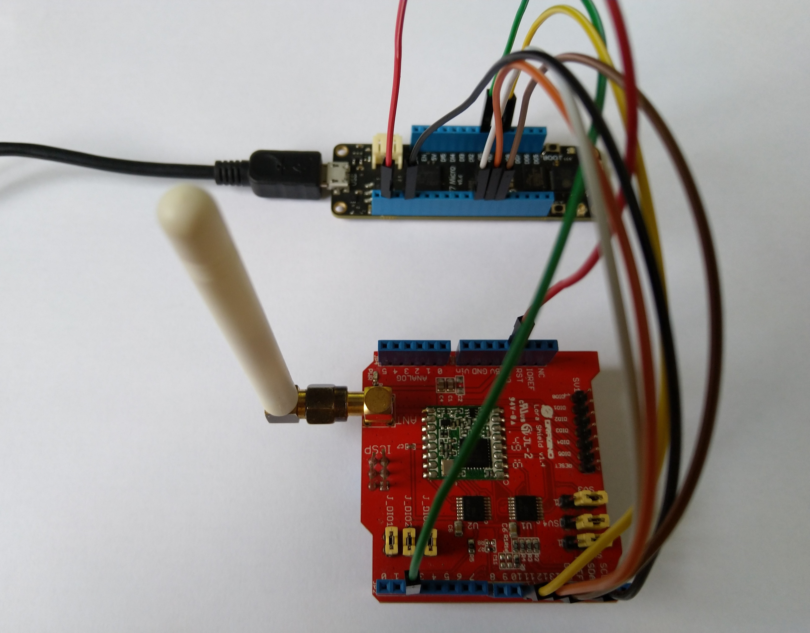

# RFM9XLoRa-Meadow
C# Semtech SX127X/RFM9X LoRa library for Wilderness Labs Meadow devices

# RFM9XLoRa-Net
A C# library for LoRa[@LoRaAlliance](https://lora-alliance.org/) connectivity for Semtech [@SX127X](https://www.semtech.com/products/wireless-rf/lora-transceivers/SX1276)/HopeRF [@RFMRFM9X](http://www.hoperf.com/rf_transceiver/lora/RFM95W.html) equipped shields on  WIlderness labs Meadow devices

The repo has the source code for the series of blog posts written as I build this library (based on my Windows 10 IoT Core library)

00. ShieldSPI
01. RegisterRead(https://blog.devmobile.co.nz/2019/12/25/net-meadow-lora-library-part1/)
02. RegisterScan(https://blog.devmobile.co.nz/2019/12/26/net-meadow-rfm95-96-97-98-lora-library-part2/)
03. RegisterReadAndWrite
04. TransmitBasic
05. ReceiveBasic
06. ReceiveInterrupt
07. TransmitInterrupt
08. ReceiveTransmitInterrupt
09. RefactorRegisterManager
10. EnumAndMasks
11. ReceiveTransmitEvents
12. ReceiveFifo

My initial test rig uses a Meadow device and a [Dragino Arduino shield](https://www.dragino.com/products/lora/item/102-lora-shield.html). I have a Adafruit [433MHz](https://www.adafruit.com/product/3232) & [868MHz](https://www.adafruit.com/product/3231) feather wings on order

There are also parallel development projects for [Windows 10 IoT Core](https://github.com/KiwiBryn/RFM9XLoRa-Net) and [.Net Micro Framework](https://github.com/KiwiBryn/RFM9XLoRa-NetMF)

