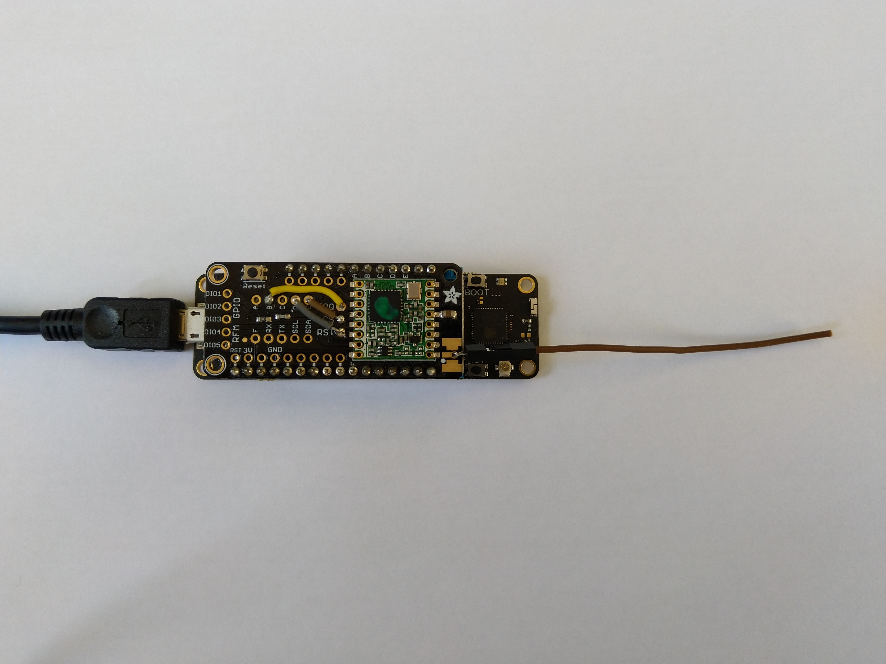

# RFM9XLoRa-Meadow
A C# library for LoRa[@LoRaAlliance](https://lora-alliance.org/) connectivity for Semtech [@SX127X](https://www.semtech.com/products/wireless-rf/lora-transceivers/SX1276)/HopeRF [@RFMRFM9X](http://www.hoperf.com/rf_transceiver/lora/RFM95W.html) equipped shields on  Wilderness labs Meadow devices

The repo has the source code for the series of blog posts written as I build this library (based on my Windows 10 IoT Core library)

00. ShieldSPI
01. RegisterRead(https://blog.devmobile.co.nz/2019/12/25/net-meadow-lora-library-part1/)
02. RegisterScan(https://blog.devmobile.co.nz/2019/12/26/net-meadow-rfm95-96-97-98-lora-library-part2/)
03. RegisterReadAndWrite(https://blog.devmobile.co.nz/2019/12/27/net-meadow-rfm95-96-97-98-lora-library-part3/)
04. TransmitBasic(https://blog.devmobile.co.nz/2019/12/28/net-meadow-rfm95-96-97-98-lora-library-part4/)
05. ReceiveBasic(https://blog.devmobile.co.nz/2019/12/28/net-meadow-rfm95-96-97-98-lora-library-part5/)
06. ReceiveInterrupt(https://blog.devmobile.co.nz/2019/12/29/net-meadow-rfm95-96-97-98-lora-library-part6/)
07. TransmitInterrupt(https://blog.devmobile.co.nz/2019/12/29/net-meadow-rfm95-96-97-98-lora-library-part7/)
08. ReceiveTransmitInterrupt(https://blog.devmobile.co.nz/2020/01/01/net-meadow-rfm95-96-97-98-lora-library-part8/)
09. RFM9X.Meadow on Github(https://blog.devmobile.co.nz/2020/01/03/rfm9x-meadow-on-github/)

My initial test rig used a Meadow device and a [Dragino Arduino shield](https://www.dragino.com/products/lora/item/102-lora-shield.html). 
 this was so I could only connect the pins that I needed.

My second test rig uses a Mead device and an Adafruit [433MHz](https://www.adafruit.com/product/3232) or [868MHz](https://www.adafruit.com/product/3231) feather wing 

There are also parallel development projects for [Windows 10 IoT Core](https://github.com/KiwiBryn/RFM9XLoRa-Net) and [.Net Micro Framework](https://github.com/KiwiBryn/RFM9XLoRa-NetMF)
